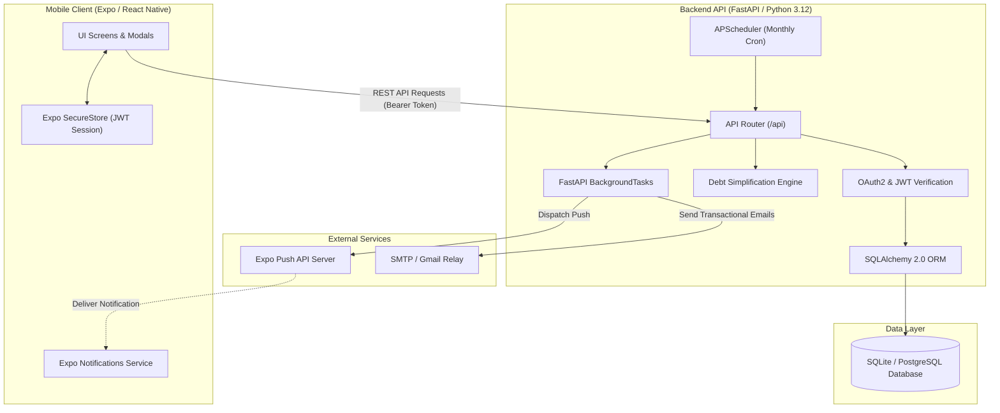
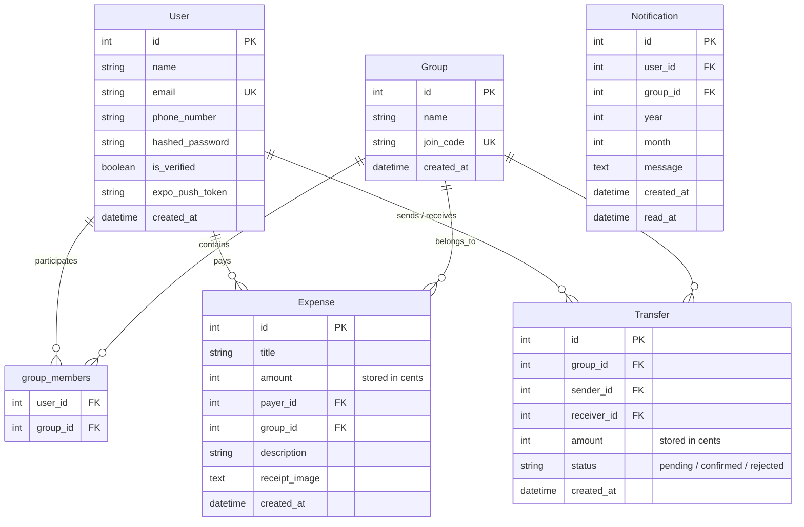

<div align="center">

# 💳 SettleApp
[](https://github.com/ahalon/Settle-UP/actions/workflows/ci.yml)

**Full-stack, mobile-first group expense sharing and debt simplification platform**  
*Split bills fairly, settle debts with minimal transactions, and track shared balances in real time.*

[](https://fastapi.tiangolo.com)
[](https://reactnative.dev)
[](https://www.typescriptlang.org)
[](https://www.sqlalchemy.org)
[](LICENSE)

</div>

---

## 📌 Overview

**SettleUp** is an end-to-end expense management application inspired by Splitwise and Tricount. It addresses the common pain points of group trip expenses, shared apartment bills, and event finances by eliminating fractional currency errors, minimizing cross-person bank transfers, and automating the settlement cycle through push notifications and transactional emails.

Unlike standard tutorial CRUD apps, **SettleUp** implements:
- A **greedy debt simplification algorithm** ($O(N \log N)$) that minimizes the total number of bank transfers needed to clear all group debts.
- A **double-sided settlement verification state machine** (`pending` $\rightarrow$ `confirmed` / `rejected`), preventing unverified or fraudulent debt clearances.
- An **integer-based financial engine** (calculating all shares in exact integer cents/grosze with remainder redistribution).
- **Asynchronous event processing** leveraging FastAPI BackgroundTasks, Expo Push Notifications, and scheduled APScheduler cron jobs.

---

## 🚀 Key Features

### 👥 Groups & Expense Management
- **Instant Lobby Joining:** Create groups with custom names and invite members using 6-character alphanumeric join codes.
- **Fair Equal Splitting with Remainder Distribution:** Divides amounts equally among members down to the cent. Any indivisible remainder ($X \pmod N$) is deterministically allocated without losing or creating a single cent.
- **Receipt Photo Attachment:** Capture and store receipt photos directly with expenses for auditability.
- **Monthly Historical Tracking:** Filter group expenses and view personalized expenditure metrics by month and year.

### 🧮 Debt Simplification & Bilateral Settlements
- **Optimized Settlement Graph:** Collapses complex webs of multi-party debts into the minimum possible number of direct peer-to-peer transfers (at most $N - 1$ transactions for $N$ members).
- **Two-Way Settlement Protocol:**
  1. A debtor initiates a settlement transfer declaration.
  2. The system validates that the amount does not exceed the debtor's liability or creditor's claim.
  3. The creditor receives an instant push notification and email.
  4. The creditor approves or rejects the settlement; group balances update only upon approval, or revert if rejected.
- **BLIK / Phone Number Integration:** Displays creditors' phone numbers directly in settlement suggestions for fast mobile payments.

### 🔔 Notifications & Automated Scheduling
- **Expo Push Notifications:** Instant device alerts for transfer declarations, confirmations, and rejections.
- **Transactional HTML Emails:** Automated verification emails, payment declaration alerts, rejection notices, and monthly summary digests.
- **Automated Monthly Schedulers:** APScheduler cron trigger (1st day of each month at 09:00 Warsaw time) and a secure webhook endpoint (`X-Cron-Key`) for automated monthly settlement prompts.

---

## 🏗️ Architecture & System Design



---

## 💾 Database Schema (ERD)



---

## 🧠 Debt Simplification Algorithm

When multiple members in a group pay for different expenses, calculating who owes whom can easily lead to a chaotic, cycle-filled graph.

SettleUp resolves this using an efficient **greedy two-pointer settlement algorithm**:

$$\sum \text{net\_balances} = 0$$

1. **Calculate Net Balances:** For each user $u$:
   $$\text{Balance}(u) = \text{TotalPaid}(u) - \text{TotalShare}(u) + \text{ConfirmedTransfersSent}(u) - \text{ConfirmedTransfersReceived}(u)$$
2. **Partition & Sort:** Separate members into **Debtors** ($\text{Balance} < 0$) and **Creditors** ($\text{Balance} > 0$). Sort both lists in descending order of absolute magnitude.
3. **Greedy Matching:** Pair the largest debtor with the largest creditor:
   $$\text{settled} = \min(|\text{debt}|, \text{credit})$$
   Record one direct transaction between them and reduce both amounts accordingly.
4. **Advance Pointers:** When an account hits zero, advance to the next debtor or creditor until all balances reach zero.

> **Result:** Resolves all debts in at most $N - 1$ total transactions (compared to potentially $\frac{N(N-1)}{2}$ chaotic transactions), making group settlements painless.

---

## 🛠️ Tech Stack

| Domain | Technology | Description |
| :--- | :--- | :--- |
| **Backend API** | [FastAPI](https://fastapi.tiangolo.com/) | High-performance Python web framework with async support & OpenAPI documentation |
| **Language** | Python 3.12+ | Strongly typed modern Python using dataclasses, unions, and type hints |
| **Database ORM** | [SQLAlchemy 2.0](https://www.sqlalchemy.org/) | Relational database modeling and query execution (SQLite/PostgreSQL compatible) |
| **Data Validation** | [Pydantic v2](https://docs.pydantic.dev/) | Strict input validation, data parsing, and serialization schemas |
| **Security & Auth** | JWT (`python-jose`) + `passlib[bcrypt]` | Stateless Bearer token authentication and cryptographic password hashing |
| **Task Scheduling** | [APScheduler](https://apscheduler.readthedocs.io/) | In-memory background cron runner for recurring monthly settlements |
| **Mobile Client** | [React Native](https://reactnative.dev/) / [Expo SDK 57](https://expo.dev/) | Cross-platform native application for iOS and Android |
| **Frontend Lang** | [TypeScript](https://www.typescriptlang.org/) | Full type safety across state, network payloads, and UI components |
| **Secure Storage** | `expo-secure-store` | Hardware-backed cryptographic key-value storage for mobile auth tokens |
| **Push Alerts** | Expo Push Notifications | Remote push notification integration |
| **Containerization** | Docker | Minimal container build using `python:3.12-slim` |

---

## 🚦 Getting Started

### Prerequisites
- **Python 3.12+**
- **Node.js 18+** and **npm**
- **Expo Go** app installed on your physical mobile device (or iOS Simulator / Android Emulator)
- *(Optional)* Docker

---

### 1. Backend Setup

1. **Navigate to the backend directory:**
   ```bash
   cd backend
   ```

2. **Create and activate a virtual environment:**
   ```bash
   python3 -m venv .venv
   source .venv/bin/activate  # On Windows: .venv\Scripts\activate
   ```

3. **Install dependencies:**
   ```bash
   pip install -r requirements.txt
   ```

4. **Configure environment variables:**
   ```bash
   cp .env.example .env
   ```
   *Edit `.env` and configure your `SECRET_KEY`, `BACKEND_URL`, and SMTP credentials.*

5. **Run the automated test suite:**
   ```bash
   pytest -v
   ```

6. **Run the FastAPI development server:**
   ```bash
   uvicorn app.main:app --host 0.0.0.0 --port 8000 --reload
   ```
   Interactive Swagger documentation will be available at:  
   👉 **http://localhost:8000/docs**

*(Alternatively, run using Docker Compose from the project root):*
```bash
# From the project root directory (not backend/):
docker compose up -d --build
```

---

### 2. Mobile App Setup

1. **Navigate to the mobile directory:**
   ```bash
   cd mobile
   ```

2. **Install dependencies:**
   ```bash
   npm install
   ```

3. **Configure the API endpoint:**
   ```bash
   cp .env.example .env
   ```
   *Set `EXPO_PUBLIC_API_URL` to your computer's local network IP address (e.g. `http://192.168.1.100:8000`) so your physical device or emulator can communicate with the backend.*

4. **Start the Expo development server:**
   ```bash
   npx expo start
   ```

5. **Run on your device:**
   - Scan the terminal QR code with your camera (iOS) or the **Expo Go** app (Android).
   - Press `i` to open in the iOS Simulator or `a` for the Android Emulator.

---

## 📡 REST API Reference

| Method | Endpoint | Description | Auth Required |
| :--- | :--- | :--- | :---: |
| `POST` | `/api/auth/register` | Register a new user account with email verification dispatch | ❌ |
| `GET` | `/api/auth/verify?token=...` | Verify email address via transactional link | ❌ |
| `POST` | `/api/auth/login` | Authenticate user & issue JWT bearer token | ❌ |
| `POST` | `/api/auth/push-token` | Register Expo push notification token | ✅ |
| `GET` | `/api/groups/my` | List all groups the current user belongs to | ✅ |
| `POST` | `/api/groups` | Create a new group lobby | ✅ |
| `POST` | `/api/groups/join` | Join an existing group using a 6-character code | ✅ |
| `GET` | `/api/groups/{id}/expenses` | Retrieve group expenses (supports `year` & `month` filters) | ✅ |
| `POST` | `/api/expenses` | Add a new group expense (with receipt attachment) | ✅ |
| `DELETE` | `/api/expenses/{id}` | Delete an expense (creator only) | ✅ |
| `GET` | `/api/groups/{id}/balance` | Fetch net balances and greedy suggested settlements | ✅ |
| `GET` | `/api/groups/{id}/monthly-summary` | Get monthly expenditure statistics & user spending breakdown | ✅ |
| `POST` | `/api/groups/{id}/transfers` | Declare a debt settlement payment | ✅ |
| `GET` | `/api/groups/{id}/transfers` | View transfer history & pending settlement requests | ✅ |
| `POST` | `/api/transfers/{id}/confirm` | Confirm receipt of transfer (creditor only) | ✅ |
| `POST` | `/api/transfers/{id}/reject` | Reject transfer declaration and restore debt | ✅ |
| `POST` | `/api/settlements/monthly-trigger` | Webhook for automated monthly settlement dispatch | Secret Header |

---

## 🗺️ Roadmap & Engineering Goals

- [x] **Automated Test Suite:** Comprehensive test coverage using `pytest` for all boundary conditions of `simplify_debts` and transfer state transitions.
- [ ] **Cloud Object Storage:** Transition receipt images from Base64 DB storage to AWS S3 / Cloudflare R2 presigned URLs.
- [ ] **Database Migrations:** Introduce [Alembic](https://alembic.sqlalchemy.org/) for continuous schema versioning.
- [ ] **CI/CD Pipeline:** GitHub Actions workflow executing code linting (`ruff`), TypeScript checks (`tsc`), and test runs on every pull request.
- [ ] **Custom Expense Splits:** Support unequal splits (percentage, share counts, itemized receipts).
- [ ] **OCR Receipt Parsing:** Integrate vision models or OCR to parse items and totals automatically from receipt images.

---

## 📄 License

This project is open-source and available under the [MIT License](LICENSE).